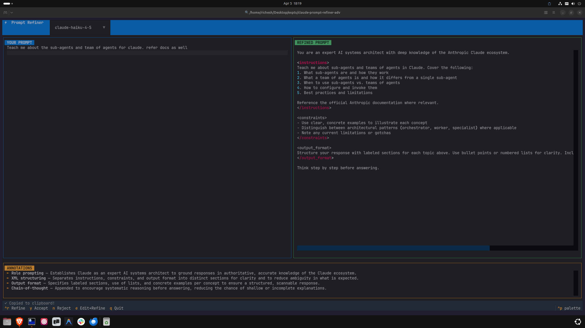

# ⚡ Prompt Refiner

A developer-native terminal UI that automatically refines your prompts using proven prompt engineering techniques — powered by your existing **Claude Code subscription**. No separate API key required.

  

## Screenshot



## Demo

```
┌─────────────────────────────────────────────────────────────────────┐
│  ⚡ Prompt Refiner   Model: [claude-sonnet-4-6 ▾]                   │
├────────────────────────┬────────────────────────────────────────────┤
│  YOUR PROMPT           │  REFINED PROMPT                            │
│                        │                                            │
│  write a function to   │  You are an expert software engineer.      │
│  parse json            │                                            │
│                        │  <instructions>                            │
│                        │  Write a function to parse JSON input.     │
│                        │  Think step by step before answering.      │
│                        │  </instructions>                           │
│                        │                                            │
│                        │  <output_format>                           │
│                        │  Provide a complete, documented function   │
│                        │  with type hints and error handling.       │
│                        │  </output_format>                          │
├────────────────────────┴────────────────────────────────────────────┤
│  ANNOTATIONS                                                        │
│  ► Role prompting — code generation task detected                   │
│  ► Chain-of-thought — improves accuracy on multi-step logic         │
│  ► XML structuring — delineates sections clearly for Claude         │
│  ► Output format — specifies expected structure and style           │
├─────────────────────────────────────────────────────────────────────┤
│  ^R Refine  y Accept  n Reject  e Edit+Refine  Tab Model  q Quit    │
└─────────────────────────────────────────────────────────────────────┘
```

## Features

- **Auto-detects task type** — code, debug, explanation, or general
- **Applies relevant techniques** — role prompting, chain-of-thought, XML structuring, output format, constraint injection
- **Annotates every change** — explains *why* each technique was applied
- **3-action workflow** — Accept (copies to clipboard), Reject, or Refine with comments
- **Model switching** — cycle between Haiku, Sonnet, and Opus with `Tab`
- **Zero setup** — uses your existing Claude Code login

## Prerequisites

- [Claude Code](https://claude.ai/code) installed and logged in (`claude login`)
- Python 3.11+

## Installation

**Via pipx** (recommended — isolated, no venv management):
```bash
pipx install claude-prompt-refiner
```

**Via Homebrew**:
```bash
brew install richeshgupta/claude-prompt-refiner/claude-prompt-refiner
```

**Via pip**:
```bash
pip install claude-prompt-refiner
```

## Usage

```bash
cpr                    # short alias
claude-prompt-refiner  # full command
```

## Keybindings

| Key | Action |
|-----|--------|
| `Ctrl+R` | Refine the prompt |
| `y` | Accept — copies refined prompt to clipboard |
| `n` | Reject — clears output, back to input |
| `e` | Refine with comments — add guidance for the next pass |
| `Tab` | Cycle model (Haiku → Sonnet → Opus) |
| `q` | Quit |

## Prompt Techniques Applied

| Task Type | Techniques |
|-----------|-----------|
| **Code generation** | Role prompting, Chain-of-thought, XML structuring, Output format, Constraint injection |
| **Debugging** | Role prompting, Constraint injection, Chain-of-thought, XML structuring |
| **Explanation** | Role prompting, Audience injection, XML structuring, Output format |
| **General** | Role prompting, XML structuring, Output format, Chain-of-thought |

## Project Structure

```
├── main.py          # Entry point
├── app.py           # Textual TUI (layout, keybindings, workers)
├── engine.py        # RefinerEngine — prompt building + JSON parsing
├── claude.py        # Subprocess wrapper for claude CLI
├── techniques.py    # Task detection + technique catalogue
├── requirements.txt
└── tests/           # 17 unit tests
```

## Running Tests

```bash
python -m pytest tests/ -v
```

## Models

| Model | Use case |
|-------|----------|
| `claude-haiku-4-5` | Fast, lightweight refinements |
| `claude-sonnet-4-6` | Default — best balance of speed and quality |
| `claude-opus-4-6` | Most thorough refinements |

## Contributing

See [CONTRIBUTING.md](CONTRIBUTING.md).

## License

MIT
